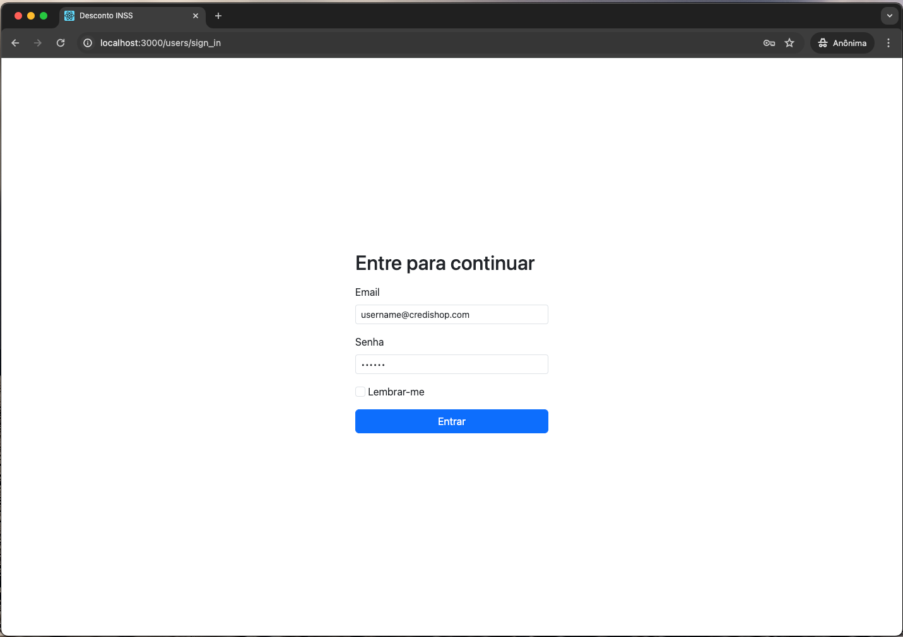
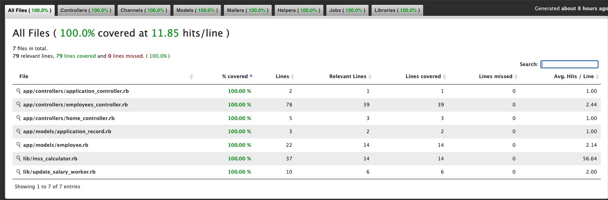
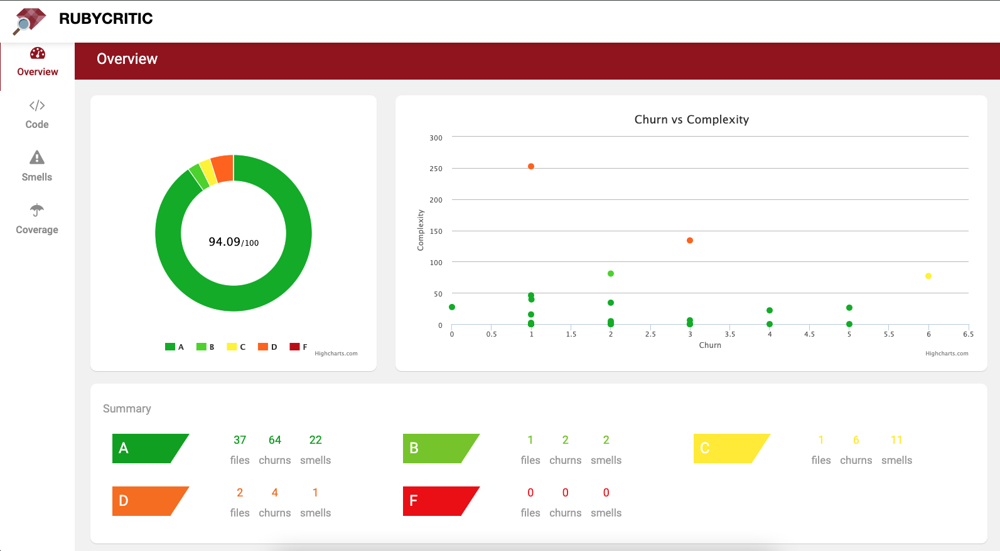

# Desconto INSS

Desafio Técnico Ruby on Rails 

Aplicação com Testes, Qualidade e Segurança de Código e Integração Contínua

## ⚙️ Objetivos

- [x] Docker 👍
- [x] Autenticação (desejável) 👍
- [x] Iniciar com pelo menos 10 registros (seed); 👍
- [x] Listagem dos Funcionários exibindo apenas 5 resultados por página 👍
- [x] Cálculo do desconto do INSS 👍
- [x] Requisição Ajax para calcular o desconto 👍
- [x] Atualização do salário utilizando Fila (sidekiq) 👍
- [x] Relatório agrupando funcionários por faixas salariais 👍

### Pré-requisitos

Antes de começar, certifique-se de ter as seguintes ferramentas instaladas e configuradas corretamente em sua máquina:
- Git
- Docker e docker-compose
- Utilitário make (opcional)

#### Executando

```bash
# Clone este repositório
$ git clone https://github.com/jhonattasantos/inss-discount.git

# Acesse o projeto pelo terminal
$ cd inss-discount

# Faça uma cópia do .env.sample
$ cp .env.sample .env

# Execute no seu terminal e pressione enter
$ make up 
# ou 
$ docker compose up

# O servidor iniciará por padrão na porta: 3000 - acesse http://localhost:3000
# OBS: Se desejar alterar a porta padrão, edite o arquivo .env

```

## Autenticação

Para se autenticar na aplicação, você pode seguir os seguintes passos:

1. Acesse a página de login da aplicação (http://localhost:3000).
2. Insira o email: username@credishop.com
3. Insira a senha: 123456
4. Clique no botão "Entrar" para enviar as informações de login.
5. Se as credenciais estiverem corretas, você será redirecionado para a página inicial da aplicação.



## Informações adicionais

#### Cobertura de testes (Rspec)

Esta aplicação possui cobertura de testes. Para verificar, execute o Rspec:
```bash
$ rspec
```
Aguarde todos os testes serem concluídos e, em seguida, verifique o arquivo:

```
coverage/index.html
```



#### Qualidade de código

Esta aplicação é analisada quanto à qualidade de código, você pode verificar com:
- rubocop
- rubycritic



#### Ferramentas de segurança de código

Esta aplicação também possui monitoramento de segurança de código com as ferramentas:
- brakeman
- bundler-audit
- ruby_audit

#### Integração Contínua

O GitHub Actions foi utilizado para integração contínua.
